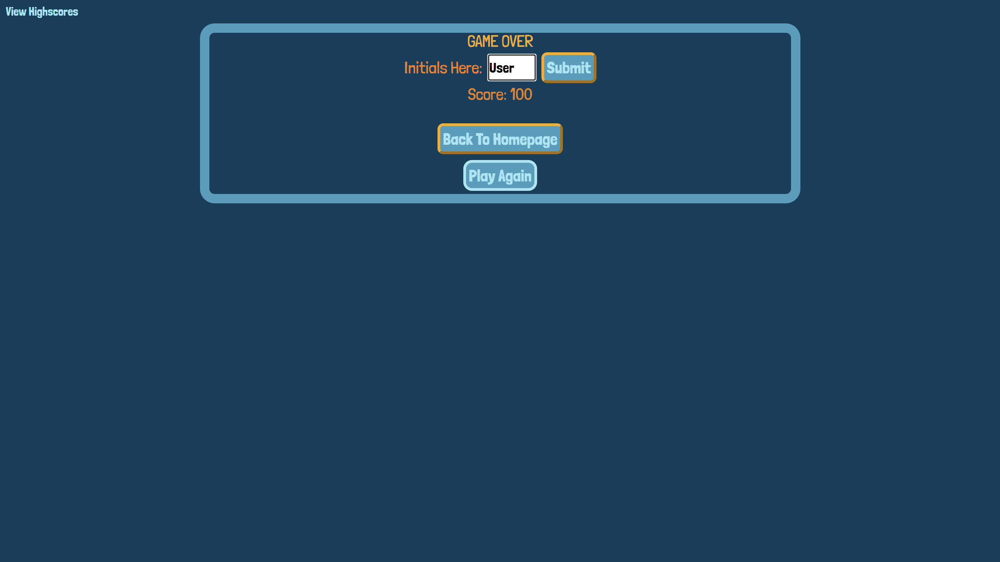
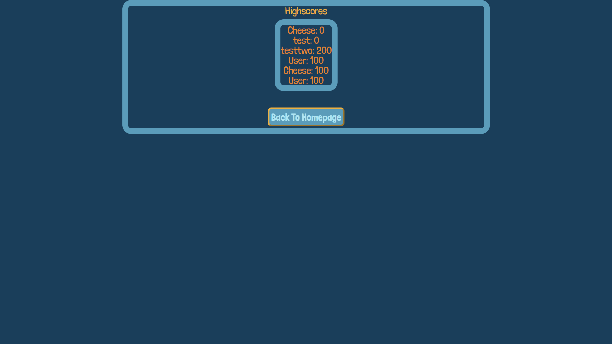

# Quiz-Game

This is a program that creates a multiple choice timed quiz. It gives 100 points for each correct answer and deducts time from the timer for every incorrect answer. When the user either runs out of time or questions the program requests initials to tie to the attempt's score. Once provided it adds the initials and score into a nested array labeled 'scoreboard' and places it into local storage. On the top left of the screen is a text button labeled 'View Highscore' which will take the user to a new screen where the user's scores of all quiz game attempts are taken from local storage and displayed. The game can repeated infinitely, and starts from clicking the cooresponding button from either the homepage or from the game over screen.

- From this project I learned how to create a timer; I learned how to properly create event listeners; how to better structure my code; and how to flip between multiple screens from a single domain.

## Usage

Upon clicking the button, the user will be prompted to type in a number for the length of their desired password. That will be followed by four more prompts asking what types of characters should be included in the password. The user's new password will then be written in the display box.

Deployed Program (Quiz Game Website): [https://smindre1.github.io/quiz-game/](!https://smindre1.github.io/quiz-game/)

## Credits

All code was built by Shane Mindreau.

The project idea was provided by Columbia Engineering Coding Boot Camp.

I used the advice from: [resource](!https://stackoverflow.com/questions/3955229/remove-all-child-elements-of-a-dom-node-in-javascript) to help me learn how to delete child elements of my view highscore's page, highscore table. Without it the user's highscore list would repeatedly accumulate everytime the user goes back to that screen.

## License

MIT License.
